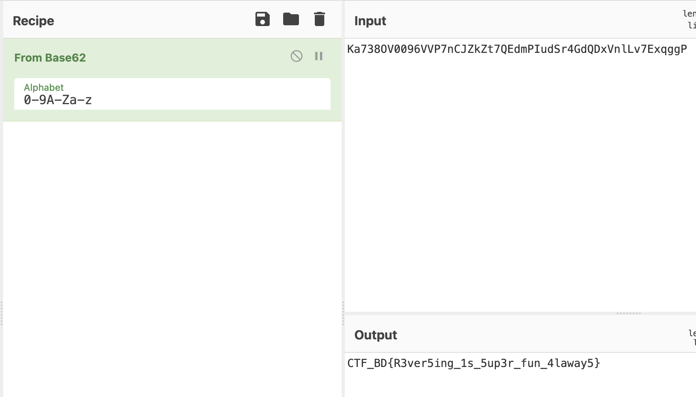

## Challenge Description
This is a ctf challenge made by me for CTF Community Bangladesh.
>**Challenge Name:** find_the_main  
>**Challenge Type:** Reversing  
>**Challenge Difficulty:** Medium/Hard  
>**Flag Format:** CTF_BD{Fake_Flag_Here}  

## Initial Enumeration
First of all a file command shows the following thing.
```bash
┌──(root💀hackingmachine)-[/home/animesh]
└─# file find_the_main
find_the_main: ELF 64-bit LSB pie executable, x86-64, version 1 (SYSV), dynamically linked, interpreter /lib64/ld-linux-x86-64.so.2, BuildID[sha1]=f737cc0f8ef35967a467e31f2ea574c568738ee0, for GNU/Linux 3.2.0, stripped
┌──(root💀hackingmachine)-[/home/animesh]
└─# 
```
From the output, It can be easily observed that the binary is a stripped binary.  
As it is a stripped binary we have to find the main functions. So, first let's find the main function to debug.  

I have opened the binary in ghidra to examine it better.

And we can see the following entry() function.

```c
void entry(undefined8 param_1,undefined8 param_2,undefined8 param_3)

{
  undefined8 in_stack_00000000;
  undefined auStack8 [8];
  
  __libc_start_main(FUN_001013c6,in_stack_00000000,&stack0x00000008,FUN_00101430,FUN_00101490,
                    param_3,auStack8);
  do {
                    /* WARNING: Do nothing block with infinite loop */
  } while( true );
}
```
Here what is hapenning, The __libc_start_main() function is loading main function basically. So the function **FUN_001013c6** is basically the main function.

Let's see what security mechanism is there
```console
┌──(root💀hackingmachine)-[/home/animesh]
└─# gdb ./find_the_main 
GNU gdb (Debian 10.1-1.7) 10.1.90.20210103-git
Copyright (C) 2021 Free Software Foundation, Inc.
License GPLv3+: GNU GPL version 3 or later <http://gnu.org/licenses/gpl.html>
This is free software: you are free to change and redistribute it.
There is NO WARRANTY, to the extent permitted by law.
Type "show copying" and "show warranty" for details.
This GDB was configured as "x86_64-linux-gnu".
Type "show configuration" for configuration details.
For bug reporting instructions, please see:
<https://www.gnu.org/software/gdb/bugs/>.
Find the GDB manual and other documentation resources online at:
    <http://www.gnu.org/software/gdb/documentation/>.

For help, type "help".
Type "apropos word" to search for commands related to "word"...
Reading symbols from ./find_the_main...
(No debugging symbols found in ./find_the_main)
gdb-peda$ checksec
CANARY    : disabled
FORTIFY   : disabled
NX        : ENABLED
PIE       : ENABLED
RELRO     : Partial
gdb-peda$ 
```
So PIE and NX are enabled. So, it will basically randomize the adresses. But gdb stop the randomization after the first run. So, let's run one time and the collect the entry() function and main function address.

```bash
Starting program: /home/animesh/find_the_main 
Please enter the secret code - 12131
You are not authorized.
[Inferior 1 (process 18260) exited normally]
Warning: not running
gdb-peda$ 
```
The program is asking for a secret code. Let's note it for now and proceed.

## Finding Flag

```bash
gdb-peda$ info file
Symbols from "/home/animesh/find_the_main".
Local exec file:
	`/home/animesh/find_the_main', file type elf64-x86-64.
	Entry point: 0x555555555080
	0x00005555555542a8 - 0x00005555555542c4 is .interp
	0x00005555555542c4 - 0x00005555555542e8 is .note.gnu.build-id
	0x00005555555542e8 - 0x0000555555554308 is .note.ABI-tag
	0x0000555555554308 - 0x000055555555432c is .gnu.hash
	0x0000555555554330 - 0x0000555555554420 is .dynsym
	0x0000555555554420 - 0x00005555555544ca is .dynstr
	0x00005555555544ca - 0x00005555555544de is .gnu.version
<!--Snip-->
gdb-peda$ 
```
we got the entry point - **0x555555555080**

let's examin next 25 instructions to get the adsress of main function.
```console
gdb-peda$ x/25i 0x555555555080
   0x555555555080:	xor    ebp,ebp
   0x555555555082:	mov    r9,rdx
   0x555555555085:	pop    rsi
   0x555555555086:	mov    rdx,rsp
   0x555555555089:	and    rsp,0xfffffffffffffff0
   0x55555555508d:	push   rax
   0x55555555508e:	push   rsp
   0x55555555508f:	lea    r8,[rip+0x3fa]        # 0x555555555490
   0x555555555096:	lea    rcx,[rip+0x393]        # 0x555555555430
   0x55555555509d:	lea    rdi,[rip+0x322]        # 0x5555555553c6
   0x5555555550a4:	call   QWORD PTR [rip+0x2f36]        # 0x555555557fe0
   0x5555555550aa:	hlt    
   0x5555555550ab:	nop    DWORD PTR [rax+rax*1+0x0]
   0x5555555550b0:	lea    rdi,[rip+0x2f91]        # 0x555555558048
   0x5555555550b7:	lea    rax,[rip+0x2f8a]        # 0x555555558048
   0x5555555550be:	cmp    rax,rdi
   0x5555555550c1:	je     0x5555555550d8
   0x5555555550c3:	mov    rax,QWORD PTR [rip+0x2f0e]        # 0x555555557fd8
   0x5555555550ca:	test   rax,rax
   0x5555555550cd:	je     0x5555555550d8
   0x5555555550cf:	jmp    rax
   0x5555555550d1:	nop    DWORD PTR [rax+0x0]
   0x5555555550d8:	ret    
   0x5555555550d9:	nop    DWORD PTR [rax+0x0]
   0x5555555550e0:	lea    rdi,[rip+0x2f61]        # 0x555555558048
gdb-peda$ 
```

As we can observe, there is a call function on **0x5555555550a4**. This basically the __libc_start_main, we have seen previously.  
> 0x55555555509d:	lea    rdi,[rip+0x322]        # 0x5555555553c6  

And the previous instruction **0x55555555509d** is basically loading the address of the main function which is **0x5555555553c6**.

Now let's examine the main function.

```console
gdb-peda$ x/50i 0x5555555553c6
   0x5555555553c6:	push   rbp
   0x5555555553c7:	mov    rbp,rsp
   0x5555555553ca:	sub    rsp,0x10
   0x5555555553ce:	lea    rdi,[rip+0xc6b]        # 0x555555556040
   0x5555555553d5:	mov    eax,0x0
   0x5555555553da:	call   0x555555555050 <printf@plt>
   0x5555555553df:	lea    rax,[rbp-0x4]
   0x5555555553e3:	mov    rsi,rax
   0x5555555553e6:	lea    rdi,[rip+0xc73]        # 0x555555556060
   0x5555555553ed:	mov    eax,0x0
   0x5555555553f2:	call   0x555555555060 <__isoc99_scanf@plt>
   0x5555555553f7:	mov    eax,DWORD PTR [rbp-0x4]
   0x5555555553fa:	cmp    eax,0x31f30b
   0x5555555553ff:	jne    0x555555555419
   0x555555555401:	lea    rdi,[rip+0xc5b]        # 0x555555556063
   0x555555555408:	call   0x555555555040 <puts@plt>
   0x55555555540d:	mov    eax,0x0
   0x555555555412:	call   0x555555555165
   0x555555555417:	jmp    0x555555555425
   0x555555555419:	lea    rdi,[rip+0xc60]        # 0x555555556080
   0x555555555420:	call   0x555555555040 <puts@plt>
   0x555555555425:	mov    eax,0x0
   0x55555555542a:	leave  
   0x55555555542b:	ret    
   0x55555555542c:	nop    DWORD PTR [rax+0x0]
   0x555555555430:	push   r15
   0x555555555432:	lea    r15,[rip+0x29af]        # 0x555555557de8
   0x555555555439:	push   r14
   0x55555555543b:	mov    r14,rdx
   0x55555555543e:	push   r13
   0x555555555440:	mov    r13,rsi
   0x555555555443:	push   r12
   0x555555555445:	mov    r12d,edi
   0x555555555448:	push   rbp
   0x555555555449:	lea    rbp,[rip+0x29a0]        # 0x555555557df0
   0x555555555450:	push   rbx
   0x555555555451:	sub    rbp,r15
   0x555555555454:	sub    rsp,0x8
   0x555555555458:	call   0x555555555000
   0x55555555545d:	sar    rbp,0x3
   0x555555555461:	je     0x55555555547e
   0x555555555463:	xor    ebx,ebx
   0x555555555465:	nop    DWORD PTR [rax]
   0x555555555468:	mov    rdx,r14
   0x55555555546b:	mov    rsi,r13
   0x55555555546e:	mov    edi,r12d
   0x555555555471:	call   QWORD PTR [r15+rbx*8]
   0x555555555475:	add    rbx,0x1
   0x555555555479:	cmp    rbp,rbx
   0x55555555547c:	jne    0x555555555468
gdb-peda$ 
```
So we can see It is basically taking a decimal input and comparing it with 0x31f30b
>    0x5555555553fa:	cmp    eax,0x31f30b

0x31f30b is 3273483 in decimal. So, the secret code is 3273483.
Now let's run the program with the secret code.

```console
gdb-peda$ r
Starting program: /home/animesh/find_the_main 
Please enter the secret code - 3273483
Welcome to the secret world!
Go slower HACKERMAN ...
[Inferior 1 (process 18417) exited normally]
Warning: not running
gdb-peda$ 
```
It is not giving the flag. Let's examine a bit further.

If we look closely it is calling another unknown function
>  0x555555555412:	call   0x555555555165

Let's examine this function as well.

```console
gdb-peda$ x/100i 0x555555555165
   0x555555555165:	push   rbp
   0x555555555166:	mov    rbp,rsp
   0x555555555169:	sub    rsp,0xe0
   0x555555555170:	mov    DWORD PTR [rbp-0x8],0x1
   0x555555555177:	mov    DWORD PTR [rbp-0xe0],0x4b
   0x555555555181:	mov    DWORD PTR [rbp-0xdc],0x61
   0x55555555518b:	mov    DWORD PTR [rbp-0xd8],0x2b
   0x555555555195:	mov    DWORD PTR [rbp-0xd4],0x33
   0x55555555519f:	mov    DWORD PTR [rbp-0xd0],0x38
   0x5555555551a9:	mov    DWORD PTR [rbp-0xcc],0x4f
   0x5555555551b3:	mov    DWORD PTR [rbp-0xc8],0x2d
   0x5555555551bd:	mov    DWORD PTR [rbp-0xc4],0x30
   0x5555555551c7:	mov    DWORD PTR [rbp-0xc0],0x30
   0x5555555551d1:	mov    DWORD PTR [rbp-0xbc],0x39
   0x5555555551db:	mov    DWORD PTR [rbp-0xb8],0x36
   0x5555555551e5:	mov    DWORD PTR [rbp-0xb4],0x2d
   0x5555555551ef:	mov    DWORD PTR [rbp-0xb0],0x2d
   0x5555555551f9:	mov    DWORD PTR [rbp-0xac],0x50
   0x555555555203:	mov    DWORD PTR [rbp-0xa8],0x2b
   0x55555555520d:	mov    DWORD PTR [rbp-0xa4],0x6e
   0x555555555217:	mov    DWORD PTR [rbp-0xa0],0x43
   0x555555555221:	mov    DWORD PTR [rbp-0x9c],0x4a
   0x55555555522b:	mov    DWORD PTR [rbp-0x98],0x5a
   0x555555555235:	mov    DWORD PTR [rbp-0x94],0x6b
   0x55555555523f:	mov    DWORD PTR [rbp-0x90],0x5a
   0x555555555249:	mov    DWORD PTR [rbp-0x8c],0x74
   0x555555555253:	mov    DWORD PTR [rbp-0x88],0x2b
   0x55555555525d:	mov    DWORD PTR [rbp-0x84],0x51
   0x555555555267:	mov    DWORD PTR [rbp-0x80],0x45
   0x55555555526e:	mov    DWORD PTR [rbp-0x7c],0x64
   0x555555555275:	mov    DWORD PTR [rbp-0x78],0x6d
   0x55555555527c:	mov    DWORD PTR [rbp-0x74],0x50
   0x555555555283:	mov    DWORD PTR [rbp-0x70],0x49
   0x55555555528a:	mov    DWORD PTR [rbp-0x6c],0x75
   0x555555555291:	mov    DWORD PTR [rbp-0x68],0x64
   0x555555555298:	mov    DWORD PTR [rbp-0x64],0x53
   0x55555555529f:	mov    DWORD PTR [rbp-0x60],0x72
   0x5555555552a6:	mov    DWORD PTR [rbp-0x5c],0x34
   0x5555555552ad:	mov    DWORD PTR [rbp-0x58],0x47
   0x5555555552b4:	mov    DWORD PTR [rbp-0x54],0x64
   0x5555555552bb:	mov    DWORD PTR [rbp-0x50],0x51
   0x5555555552c2:	mov    DWORD PTR [rbp-0x4c],0x44
   0x5555555552c9:	mov    DWORD PTR [rbp-0x48],0x78
   0x5555555552d0:	mov    DWORD PTR [rbp-0x44],0x2d
   0x5555555552d7:	mov    DWORD PTR [rbp-0x40],0x6e
   0x5555555552de:	mov    DWORD PTR [rbp-0x3c],0x6c
   0x5555555552e5:	mov    DWORD PTR [rbp-0x38],0x4c
   0x5555555552ec:	mov    DWORD PTR [rbp-0x34],0x76
   0x5555555552f3:	mov    DWORD PTR [rbp-0x30],0x2b
   0x5555555552fa:	mov    DWORD PTR [rbp-0x2c],0x45
   0x555555555301:	mov    DWORD PTR [rbp-0x28],0x78
   0x555555555308:	mov    DWORD PTR [rbp-0x24],0x71
   0x55555555530f:	mov    DWORD PTR [rbp-0x20],0x67
   0x555555555316:	mov    DWORD PTR [rbp-0x1c],0x67
   0x55555555531d:	mov    DWORD PTR [rbp-0x18],0x50
   0x555555555324:	cmp    DWORD PTR [rbp-0x8],0x0
   0x555555555328:	jne    0x5555555553b7
   0x55555555532e:	lea    rdi,[rip+0xcd3]        # 0x555555556008
   0x555555555335:	mov    eax,0x0
   0x55555555533a:	call   0x555555555050 <printf@plt>
   0x55555555533f:	mov    DWORD PTR [rbp-0x4],0x0
   0x555555555346:	jmp    0x5555555553a3
   0x555555555348:	mov    eax,DWORD PTR [rbp-0x4]
   0x55555555534b:	cdqe   
   0x55555555534d:	mov    eax,DWORD PTR [rbp+rax*4-0xe0]
   0x555555555354:	cmp    eax,0x2b
   0x555555555357:	jne    0x55555555536b
   0x555555555359:	mov    eax,DWORD PTR [rbp-0x4]
   0x55555555535c:	cdqe   
   0x55555555535e:	mov    DWORD PTR [rbp+rax*4-0xe0],0x37
   0x555555555369:	jmp    0x55555555538c
   0x55555555536b:	mov    eax,DWORD PTR [rbp-0x4]
   0x55555555536e:	cdqe   
   0x555555555370:	mov    eax,DWORD PTR [rbp+rax*4-0xe0]
   0x555555555377:	cmp    eax,0x2d
   0x55555555537a:	jne    0x55555555538c
   0x55555555537c:	mov    eax,DWORD PTR [rbp-0x4]
   0x55555555537f:	cdqe   
   0x555555555381:	mov    DWORD PTR [rbp+rax*4-0xe0],0x56
   0x55555555538c:	mov    eax,DWORD PTR [rbp-0x4]
   0x55555555538f:	cdqe   
   0x555555555391:	mov    eax,DWORD PTR [rbp+rax*4-0xe0]
   0x555555555398:	mov    edi,eax
   0x55555555539a:	call   0x555555555030 <putchar@plt>
   0x55555555539f:	add    DWORD PTR [rbp-0x4],0x1
   0x5555555553a3:	mov    eax,DWORD PTR [rbp-0x4]
   0x5555555553a6:	cmp    eax,0x32
   0x5555555553a9:	jbe    0x555555555348
   0x5555555553ab:	mov    edi,0xa
   0x5555555553b0:	call   0x555555555030 <putchar@plt>
   0x5555555553b5:	jmp    0x5555555553c3
   0x5555555553b7:	lea    rdi,[rip+0xc69]        # 0x555555556027
   0x5555555553be:	call   0x555555555040 <puts@plt>
   0x5555555553c3:	nop
   0x5555555553c4:	leave  
   0x5555555553c5:	ret    
   0x5555555553c6:	push   rbp
   0x5555555553c7:	mov    rbp,rsp
   0x5555555553ca:	sub    rsp,0x10
   0x5555555553ce:	lea    rdi,[rip+0xc6b]        # 0x555555556040
gdb-peda$ 
```
This is a long function. But we can see a compare.

> 0x555555555324:	cmp    DWORD PTR [rbp-0x8],0x0

Lets' set a breakpoint here with b * 0x555555555324 and run the program

```console
gdb-peda$ r
Starting program: /home/animesh/find_the_main 
Please enter the secret code - 3273483
Welcome to the secret world!
[----------------------------------registers-----------------------------------]
RAX: 0x0 
RBX: 0x0 
RCX: 0x7ffff7ee5f33 (<__GI___libc_write+19>:	cmp    rax,0xfffffffffffff000)
RDX: 0x0 
RSI: 0x5555555592a0 ("Welcome to the secret world!\n- ")
RDI: 0x7ffff7fb8670 --> 0x0 
RBP: 0x7fffffffe410 --> 0x7fffffffe430 --> 0x555555555430 (push   r15)
RSP: 0x7fffffffe330 --> 0x610000004b ('K')
RIP: 0x555555555324 (cmp    DWORD PTR [rbp-0x8],0x0)
R8 : 0x1d 
R9 : 0x0 
R10: 0xfffffffffffff28a 
R11: 0x246 
R12: 0x555555555080 (xor    ebp,ebp)
R13: 0x0 
R14: 0x0 
R15: 0x0
EFLAGS: 0x206 (carry PARITY adjust zero sign trap INTERRUPT direction overflow)
[-------------------------------------code-------------------------------------]
   0x55555555530f:	mov    DWORD PTR [rbp-0x20],0x67
   0x555555555316:	mov    DWORD PTR [rbp-0x1c],0x67
   0x55555555531d:	mov    DWORD PTR [rbp-0x18],0x50
=> 0x555555555324:	cmp    DWORD PTR [rbp-0x8],0x0
   0x555555555328:	jne    0x5555555553b7
   0x55555555532e:	lea    rdi,[rip+0xcd3]        # 0x555555556008
   0x555555555335:	mov    eax,0x0
   0x55555555533a:	call   0x555555555050 <printf@plt>
[------------------------------------stack-------------------------------------]
0000| 0x7fffffffe330 --> 0x610000004b ('K')
0008| 0x7fffffffe338 --> 0x330000002b ('+')
0016| 0x7fffffffe340 --> 0x4f00000038 ('8')
0024| 0x7fffffffe348 --> 0x300000002d ('-')
0032| 0x7fffffffe350 --> 0x3900000030 ('0')
0040| 0x7fffffffe358 --> 0x2d00000036 ('6')
0048| 0x7fffffffe360 --> 0x500000002d ('-')
0056| 0x7fffffffe368 --> 0x6e0000002b ('+')
[------------------------------------------------------------------------------]
Legend: code, data, rodata, value

Breakpoint 1, 0x0000555555555324 in ?? ()
gdb-peda$ 
```
So we have hit the breakpoint and now let's jump to **0x55555555532e** 
```console
0x55555555532e:	lea    rdi,[rip+0xcd3]        # 0x555555556008
gdb-peda$ x/s 0x555555556008
0x555555556008:	"Here is your encrypted flag - "
gdb-peda$ 
```
Because it is pointing to some juicy things.
```console
gdb-peda$ j * 0x55555555532e
Continuing at 0x55555555532e.
Here is your encrypted flag - Ka738OV0096VVP7nCJZkZt7QEdmPIudSr4GdQDxVnlLv7ExqggP
[Inferior 1 (process 18489) exited normally]
Warning: not running
gdb-peda$ 
```
And we got the encrypted flag "Ka738OV0096VVP7nCJZkZt7QEdmPIudSr4GdQDxVnlLv7ExqggP" 

Now looking at the flag it is looking like some kind of base. 
Let's decode it using cyberchef



Hoorah! We got the flag - **CTF_BD{R3ver5ing_1s_5up3r_fun_4laway5}**

Thank you for reading this far.